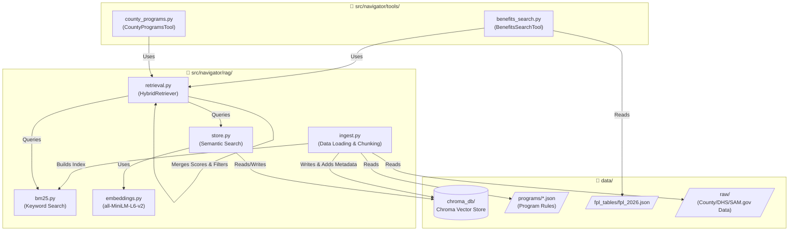
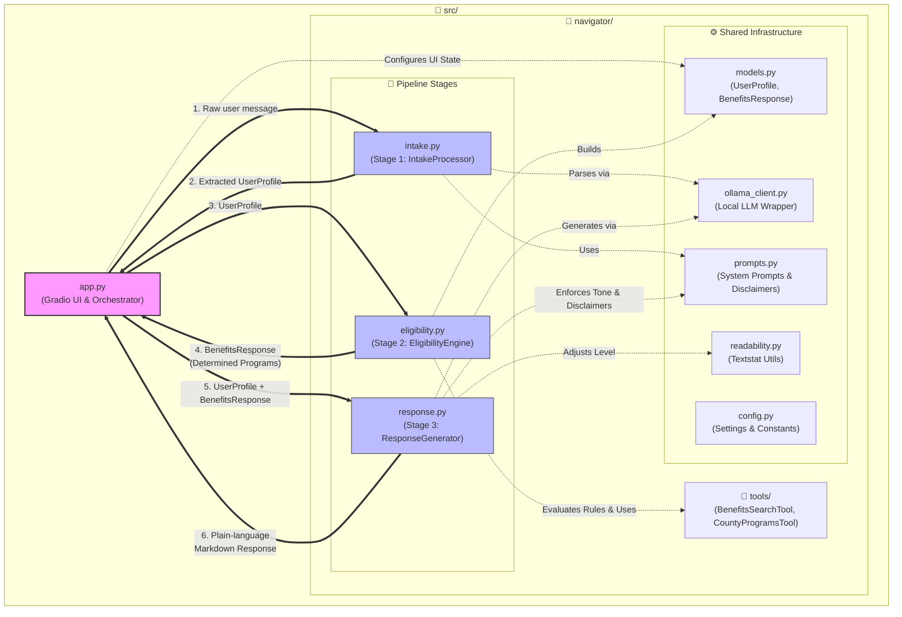
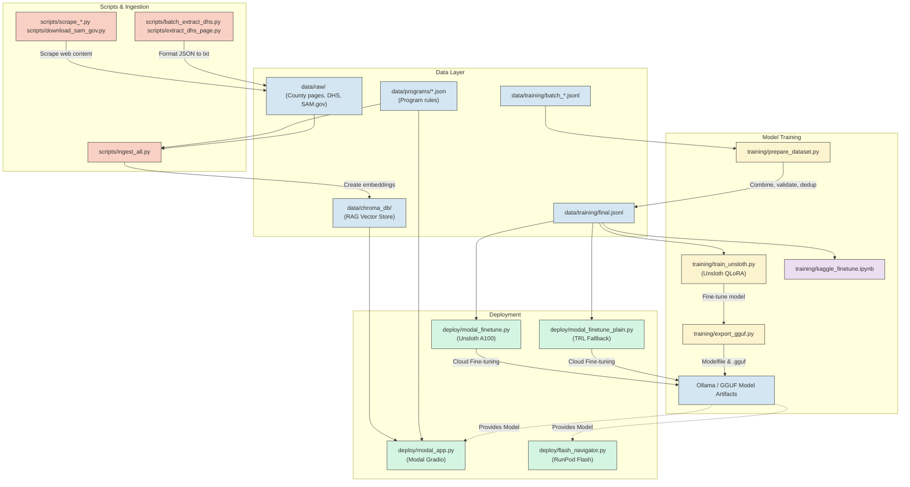

# NorthStar Navigator

## Introduction
The **NorthStar Navigator** is a privacy-first, AI-powered application developed for the **Kaggle Gemma 4 Good Hackathon**. Navigating government assistance programs can be overwhelming, especially when faced with complex terminology, strict eligibility rules, and dispersed information. This application aims to simplify that process by helping users identify and understand government benefits programs—with a specific focus on Minnesota—using accessible, plain language. 

By leveraging local Large Language Models (LLMs)—specifically targeting the Gemma 4 E4B model—the Navigator ensures that sensitive user situations and personal data remain entirely private and secure on their local machine.

## Overview
The Navigator functions as an intelligent, conversational guide that processes user input and matches it against known government assistance programs (including 15-20 federal programs, 15+ Minnesota state programs, and specific Twin Cities metro county programs). 

To ensure accuracy and approachability, the application relies on an intelligent three-stage pipeline:
1. **Intake:** The system interacts with the user to extract a structured profile, parsing their unique situation and asking clarifying questions if necessary details are missing.
2. **Eligibility:** Using a Retrieval-Augmented Generation (RAG) pipeline, the application cross-references the user's profile against predefined program rules and eligibility criteria to find potential matches.
3. **Response Generation:** The final step translates complex government program details into a plain-language response tailored to the user's reading level and preferred language, complete with rigorous citations.

The application features a clean user interface built with Gradio and relies on Ollama for local model execution, providing a seamless and secure user experience.

## Core Features
*   **Privacy-First Local Execution:** All natural language processing runs locally via Ollama. Sensitive personal, financial, and household details never leave the user's machine.
*   **Intelligent Profile Extraction:** Automatically parses conversational input to build a structured profile, proactively asking clarifying questions to gather required eligibility details.
*   **Targeted Program Matching:** Employs robust hybrid search (vector embeddings combined with keyword search) to evaluate eligibility against federal, state, and county-specific rules.
*   **Adjustable Readability Levels:** Generates responses tailored to specific reading levels (Simple, Standard, Detailed) using the `textstat` library to ensure true "plain language" accessibility.
*   **Mandatory Disclaimers & Safety:** Enforces strict safety rails, ensuring the AI never provides definitive legal or financial determinations, but rather assesses *potential* eligibility and points to official government resources.
*   **Multilingual Support:** Capable of generating tailored responses in multiple languages (e.g., English, Spanish) to better serve diverse communities.

## Getting Started

### Prerequisites
Before running the application, ensure you have the following installed:
*   **Python 3.13+**
*   **`uv`**: The fast Python package manager.
*   **Ollama**: Must be installed and running locally as a service (`systemctl start ollama` on Linux, or via the desktop application).

*Note: The application currently defaults to the `gemma3:4b` model via Ollama (until the Gemma 4 E4B model is available). Ensure you have pulled the model before starting:*
```bash
ollama pull gemma3:4b
```

### Installation
Clone the repository and navigate to the project directory. Install the application dependencies using `uv`. Note that navigator dependencies are kept separate from the heavier training stacks to prevent conflicts:

```bash
uv sync --extra navigator
```

### Running the Application
Launch the Gradio user interface by running the main application script. 

*Important: Always use `uv run` to ensure the correct virtual environment is used, and set the protocol buffers environment variable for ChromaDB compatibility:*

```bash
PROTOCOL_BUFFERS_PYTHON_IMPLEMENTATION=python uv run python src/app.py
```
Once the server starts, open your web browser and navigate to `http://0.0.0.0:7860` to access the application.

### Running Tests
To verify your installation and run the project's test suite, you can run `pytest`:

```bash
uv run pytest tests/ -v
```

## Architecture and Data Flow

This section outlines the architecture and data flows of the project across three key domains: RAG & Data Architecture, Core Application Architecture, and Training, Scripts & Deployment.

### 1. RAG & Data Architecture

The knowledge retrieval layer of the NorthStar Navigator relies on a hybrid search architecture designed to handle both semantic queries and exact-match terminology common in government manuals. 

*   **Vector Store & Embeddings**: The project uses **ChromaDB** as its local vector database (`src/navigator/rag/store.py`). Document chunks are embedded using the `sentence-transformers/all-MiniLM-L6-v2` model, which provides a fast, lightweight semantic representation of complex program rules.
*   **Hybrid Search Strategy**: To overcome the limitations of purely semantic search—which often struggles with specific program acronyms (e.g., "MFIP", "CCAP")—the pipeline supplements ChromaDB's vector search with a **BM25 sparse keyword index**. This dual-search approach ensures high recall for both conceptual queries (e.g., "food help") and exact programmatic terms.
*   **Ingestion Pipeline**: The ingestion engine (`scripts/ingest_all.py`) processes multiple data formats. It parses structured JSON files containing core program thresholds (`data/programs/`) and chunks raw scraped HTML/text from external sources, including the Minnesota DHS Combined Manual, county pages, and SAM.gov. As chunks are ingested into ChromaDB, they are tagged with metadata properties like `jurisdiction`, `category`, and `program` to allow for strict pre-filtering during retrieval.



### 2. Core Application Architecture

The application orchestrates a three-stage pipeline to bridge the gap between unstructured user queries and rigorous government criteria, all wrapped in a responsive user interface.

*   **User Interface**: **Gradio** powers the frontend (`src/app.py`), providing an accessible, chat-like interface. Gradio's sidebar components are utilized to let users dynamically control the application's configuration, including selecting a target reading level ("Simple", "Standard", "Detailed") and language translation (English, Spanish, Hmong, Somali, Karen).
*   **Stage 1: Intake**: When a user submits a query, the `IntakeProcessor` (`src/navigator/intake.py`) uses a local LLM via **Ollama** to parse the unstructured text into a strongly typed `UserProfile` Pydantic model. The LLM extracts demographic, financial, and geographic data, and can optionally flag missing information to ask clarifying questions.
*   **Stage 2: Eligibility Engine**: The `EligibilityEngine` (`src/navigator/eligibility.py`) serves as the core logic hub. It intentionally offloads deterministic calculations from the LLM to Python-based tools. It calculates Federal Poverty Level (FPL) thresholds, age restrictions, and household size checks using hard-coded functions. For nuanced requirements, it triggers the RAG pipeline to search ChromaDB via Tools. The engine compiles these checks into a structured `BenefitsResponse` object.
*   **Stage 3: Response Generation**: Finally, the `ResponseGenerator` (`src/navigator/response.py`) takes the structured `BenefitsResponse` and feeds it back into the local LLM via **Ollama**. Bound by a strict system prompt tailored to the Gradio-selected reading level and language, the model generates an empathetic, plain-language summary of potential eligibility. The system automatically appends a mandatory legal disclaimer to ensure the application only advises on *potential* eligibility rather than guaranteeing benefits.



### 3. Training, Scripts, and Deployment

To ensure the model accurately translates dense bureaucratic language into accessible prose without hallucinating eligibility criteria, the project relies on a localized fine-tuning and deployment toolchain.

*   **Parameter-Efficient Fine-Tuning (PEFT)**: The project uses **Unsloth** in conjunction with the `trl` `SFTTrainer` (`training/train_unsloth.py`) to fine-tune the Gemma 4 E4B model. By utilizing QLoRA (Quantized Low-Rank Adaptation), Unsloth heavily optimizes GPU memory consumption, allowing the model to be fine-tuned locally on an RTX 2080 Ti or in the cloud via Kaggle's T4 instances and Modal A100 deployments. 
*   **Training Data**: The models are trained on specialized JSONL datasets (`data/training/`) that map confusing DHS manual excerpts to their corresponding plain-language translations across multiple languages and edge-case scenarios. 
*   **GGUF Export & Inference Deployment**: Following fine-tuning, Unsloth's export utilities (`training/export_gguf.py`) package the updated model weights into the quantized GGUF format. 
*   **Local Privacy via Ollama**: The resulting GGUF artifact is served locally using **Ollama** (`src/navigator/ollama_client.py`). Because Ollama runs entirely on the host machine, all highly sensitive user profile data (e.g., household income, disability status, immigration status) is processed locally. This architecture guarantees that no personally identifiable information (PII) is ever transmitted to a third-party cloud provider, adhering to strict data privacy and safety standards.

