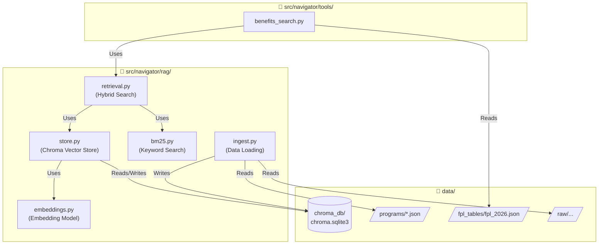
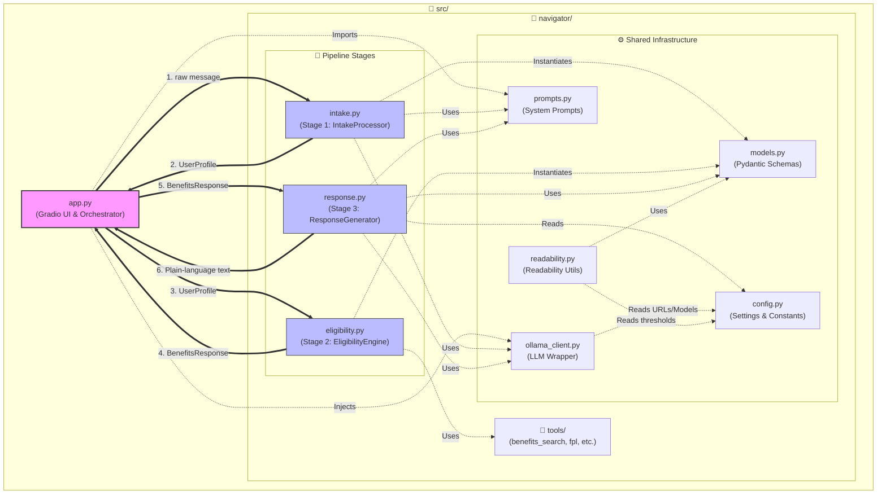
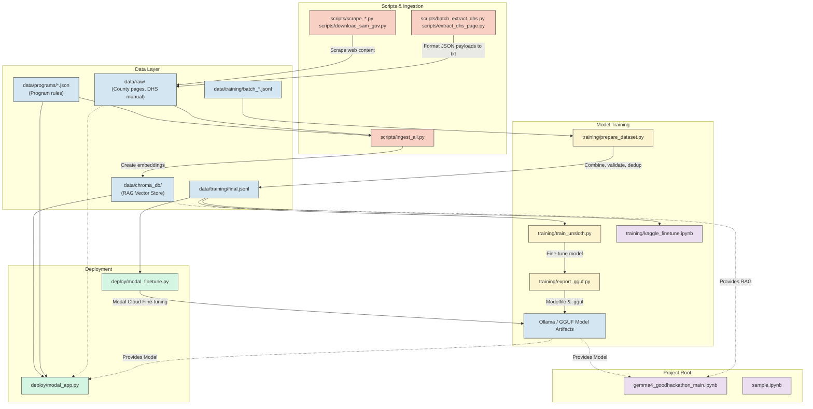

# Kaggle Competition: Gemma 4 Good Hackathon

# Overview
[insert personal goal and overview for competition here once decided upon]

# File Structure

This section outlines the architecture and data flows of the project across three key domains: RAG & Data Architecture, Core Application Architecture, and Training, Scripts & Deployment.

### 1. RAG & Data Architecture
This diagram outlines how raw data, parsed programs, and Federal Poverty Level (FPL) tables flow into the RAG pipeline (`src/navigator/rag/`) and are exposed via tool endpoints.

### 2. Core Application Architecture
This diagram maps `src/app.py` and the `src/navigator/` package, highlighting the 3-stage pipeline used to process user input.

### 3. Training, Scripts, and Deployment
This maps out the project's outer directories: scraping the initial dataset, merging `.jsonl` files for fine-tuning, and handling deployment artifacts.

